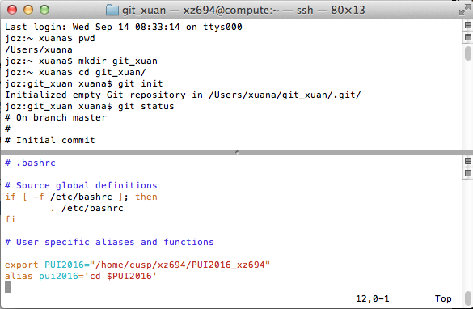
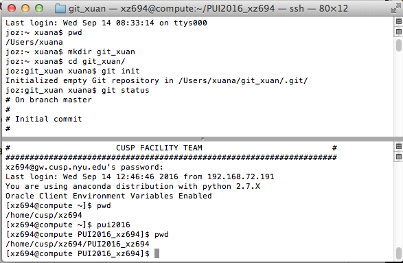

## HW1, Assignment 1:

->Finish Lab 1

I created the repo and the single file, although, they are named slightly different. <Note: files are created as I followed the lab instructions and that's before checking the HW1 specfications which include the naming...>

Repo on GitHub: git_xuan

Single file within: firstfile.txt <There should be records for at least two resolved conflics, since I did it twice on purpose...>

->Work on a fork

I attempted to team up with fellow student whose netID is gsm317. I made a change in my copy and sent a pull request.

##Assignment 2:

Setting up environment on Compute and Creating another repository.

On my compute account, I use the command "vi .bashrc" to open the .bashrc file, and add the environment variable of PUI2016 and also the alias pui2016.

I save the vi file before existing, and then reconnect to the Compute to test whether they are permanently saved. Turns out that they are.

